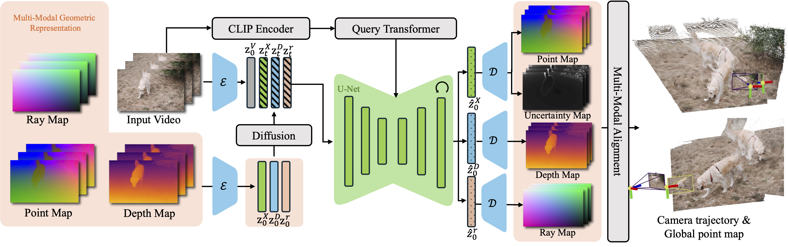
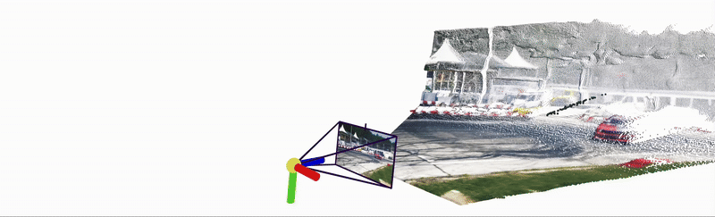

## ___***Geo4D: Leveraging Video Generators for Geometric 4D Scene Reconstruction***___
<!-- <div align="center"> -->
<p align="center">
</img>
</p>

## [Paper](https://arxiv.org/pdf/xxx.xxxxx) | [Video Youtube](https://youtu.be/HHQG26mZicE) | [Project Page](https://geo4d.github.io) 

<p align="center">
 
</p>

## ⚙️ Setup

### Install Environment via Anaconda (Recommended)
```bash
conda create -n geo4d python=3.8.5
conda activate geo4d
pip install -r requirements.txt
```
Install [Pytorch3D](https://github.com/facebookresearch/pytorch3d/blob/main/INSTALL.md)
```bash
pip install "git+https://github.com/facebookresearch/pytorch3d.git"
# recommend build from source
```
Download model checkpoint
```bash
mkdir checkpoints
mkdir checkpoints/geo4d
gdown 10SPKkOpou2lKl9bwkgx1d6YocYkmSxQl -O ./checkpoints/geo4d/ # fine-tuned vae model
gdown 11K0ubqytun-SA5RIOgR7ejNIR8B4uois -O ./checkpoints/geo4d/ # whole model
```

## Evaluation

Please first refer to the [evaluation_script.md](data/evaluation_script.md) to download the evaluation datasets.

Then, run the evaluation script:
```bash 
bash scripts/eval.sh [sintel|bonn|kitti|tum|davis] gpu_id 
# e.g. bash scripts/eval.sh sintel 0
```

## Visualization

You could then use the `viser` to visualize the results:
```bash
python viser/visualizer.py --data path/to/results/folder --no_mask
```

<p align="center">
   
</p>

<p align="center">
     
</p>

## Acknowledgement
We have used codes from other great research work, including [DuST3R](https://github.com/naver/dust3r), [MonST3R](https://github.com/Junyi42/monst3r), [DepthCrafter](https://github.com/Tencent/DepthCrafter), [DynamiCrafter](https://github.com/Doubiiu/DynamiCrafter), [RayDiffusion](https://github.com/jasonyzhang/RayDiffusion). We sincerely thank the authors for their awesome work!

## Related Works 
Here are more recent 3D/4D reconstruction projects from our team:
* [Dynamic Point Maps: A Versatile Representation for Dynamic 3D Reconstruction](https://www.robots.ox.ac.uk/~vgg/research/dynamic-point-maps/)
* [Flash3D: Feed-Forward Generalisable 3D Scene Reconstruction from a Single Image](https://www.robots.ox.ac.uk/~vgg/research/flash3d/)
* [Amodal3R: Amodal 3D Reconstruction from Occluded 2D Images](https://sm0kywu.github.io/Amodal3R/)
* [VGGT: Visual Geometry Grounded Transformer](https://vgg-t.github.io/)

## BibTeX
If you find Geo4D useful for your research and applications, please cite us using this BibTex:
```
@misc{Geo4D,
      title={Geo4D: Leveraging Video Generators for Geometric 4D Scene Reconstruction}, 
      author={Jiang, Zeren and Zheng, Chuanxia and Laina, Iro and Larlus, Diane and Vedaldi, Andrea},
      year={2025},
      archivePrefix={arXiv},
      primaryClass={cs.CV}
  }
```
